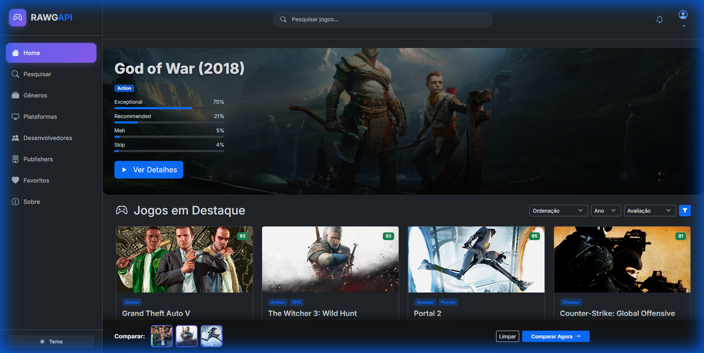
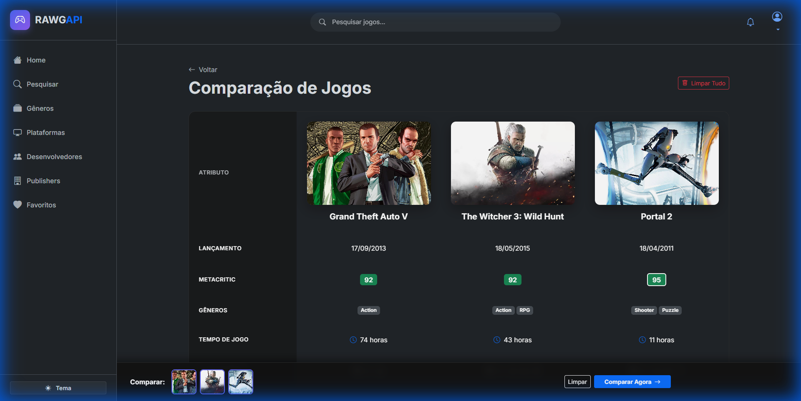
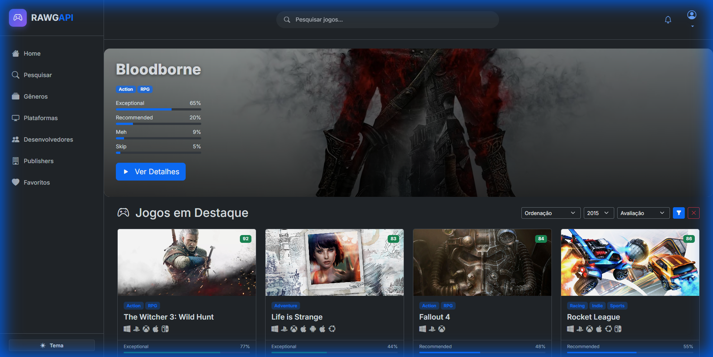

# RAWG API - Portfolio Project 🎮

<div align="center">




### Uma experiência moderna de descoberta de jogos construída com Engenharia de Software sólida.

[Funcionalidades](#-funcionalidades) • [Galeria](#-galeria) • [Instalação](#-instalação) • [Tecnologias](#-tecnologias)

</div>

---

## 📖 Sobre o Projeto

Este projeto converte a **RAWG API** em uma plataforma de descoberta de jogos de alta performance e visualmente impactante. Mais do que um simples wrapper de API, o **RAWG_v2** é uma demonstração de **arquitetura de software limpa**, utilizando o padrão **MVC (Model-View-Controller)** sem depender de frameworks pesados de backend, provando domínio sobre PHP nativo moderno.

O foco foi entregar uma User Experience (UX) de nível "Gamer Premium", com glassmorphism, efeitos neon, e interatividade fluida, enquanto mantém o código organizado, seguindo as **PSR-4** e **PSR-12**.

## ✨ Funcionalidades

### Core & Descoberta
| Feature | Descrição |
|---------|-----------|
| 🔍 **Busca Avançada** | Pesquise jogos por nome com sugestões inteligentes e histórico recente. |
| 🎛️ **Filtros Poderosos** | **Novo!** Filtre por Ano de Lançamento, Nota Metacritic (>90, >80) e Ordenação dinâmica. |
| 📄 **Paginação Full** | Navegação robusta em todas as listas (Desenvolvedores, Publishers, Plataformas). |
| ❤️ **Favoritos** | Sistema de "Wishlist" local persistente para salvar seus jogos preferidos. |

### Diferenciais de Portfólio
| Feature | Detalhes Técnicos |
|---------|-------------------|
| 🆚 **Comparador de Jogos** | **Highlight!** Selecione até 3 jogos para comparar lado a lado specs, notas e lançamentos. (JS + LocalStorage). |
| 🎨 **Design System** | UI Kit personalizado sobre Bootstrap 5, com tema Dark/Light e componentes Glassmorphism. |
| 📱 **PWA Ready** | Instalável como aplicativo nativo graças ao `manifest.json` e Service Worker configurado. |
| 🏛️ **Arquitetura MVC** | Router personalizado, Controllers magros e Services desacoplados. |

---

## 📸 Galeria

### Comparação de Jogos
Uma tabela interativa para decidir qual o próximo jogo da sua lista.


### Filtros Avançados & Home
Refine sua busca com precisão.


### Página Sobre & Footer
Identidade visual coesa e links profissionais.


---

## 🚀 Tecnologias & Arquitetura

O projeto foi construído "from scratch" para demonstrar fundamentos sólidos.

### Backend (PHP 8.2)
- **Design Pattern**: MVC (Model-View-Controller).
- **Router**: Motor de rotas personalizado `App\Core\Router`.
- **Services**: `RawgApiService` encapsula a lógica externa.
- **Standards**: PSR-4 Autoloading, Strict Types.

### Frontend
- **Framework**: Bootstrap 5.3 (Grid, Utilities).
- **CSS Avançado**: CSS Variables, Backdrop Filter (Glassmorphism), Animações CSS3.
- **JavaScript**: ES6 Modules, Async/Await para interações sem reload.

### Estrutura de Pastas
```bash
RAWG_v2/
├── 📂 src/
│   ├── Controllers/   # Lógica de controle (Comparison, Home, etc.)
│   ├── Models/        # (Opcional para expansão com DB)
│   ├── Views/         # Templates PHP limpos
│   ├── Core/          # Router e Configurações
│   └── Services/      # Integrações de API
├── 📂 public/         # Assets estáticos (CSS, JS, Images)
└── 📄 index.php       # Entry Point Único
```

---

## 📦 Instalação

Quer rodar localmente? É simples.

1. **Clone o repositório**
   ```bash
   git clone https://github.com/AndersonC96/RAWG_v2.git
   cd RAWG_v2
   ```

2. **Configure a API**
   - Renomeie `.env.example` para `.env`.
   - Obtenha sua chave gratuita em [rawg.io/apidocs](https://rawg.io/apidocs).
   - Insira no arquivo: `RAWG_API_KEY=sua_chave_aqui`.

3. **Rode o Servidor**
   ```bash
   # Com PHP embutido
   php -S localhost:8080
   
   # Ou mova a pasta para htdocs do XAMPP/Apache
   ```

4. **Acesse**
   Abra `http://localhost:8080/RAWG_v2` (se no XAMPP) ou a porta configurada.

---

<div align="center">

**Desenvolvido por [Anderson Cavalcante](https://www.linkedin.com/in/andersoncavalcante96)**

</div>
